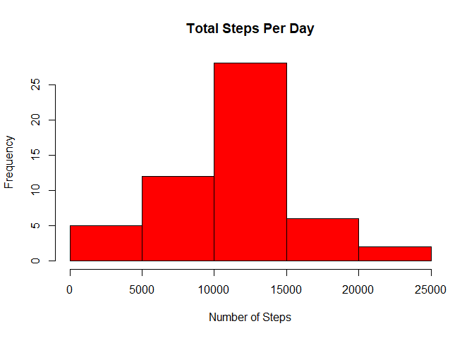
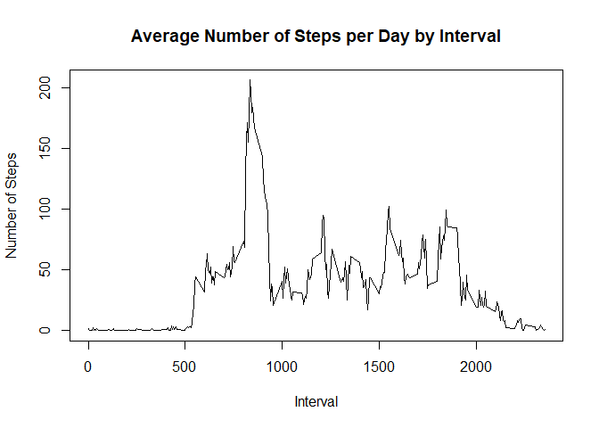
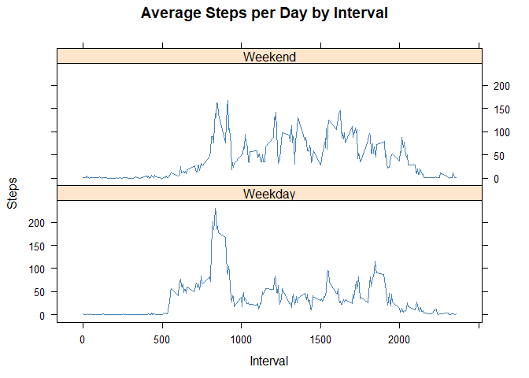

## Loading and preprocessing the data
First, we have to load the data (which is in the CSV format) into our workspace.

```r
if (!file.exists("activity.csv") )
{
  url <- 'http://d396qusza40orc.cloudfront.net/repdata%2Fdata%2Factivity.zip'  
  download.file(url,destfile='repdata%2Fdata%2Factivity.zip',mode='wb')  
  unzip('repdata%2Fdata%2Factivity.zip')
}
```

Now we will read the data.

```r
data <- read.csv("activity.csv")
```

## What is mean total number of steps taken per day?

### A histogram representation 

```r
steps_by_day <- aggregate(steps ~ date, data, sum)
hist(steps_by_day$steps, main = paste("Total Steps Per Day"), col="Red",xlab="Number of Steps")
```

<!-- -->

### Mean

```r
rmean <- mean(steps_by_day$steps)
rmean
```

```
## [1] 10766.19
```

### Median

```r
rmedian <- median(steps_by_day$steps)
rmedian
```

```
## [1] 10765
```


## What is the average daily activity pattern?

### Making a time series plot of the 5-minute interval (x-axis) and the average number of steps taken, averaged across all days (y-axis)

```r
steps_by_interval <- aggregate(steps ~ interval, data, mean)
plot(steps_by_interval$interval,steps_by_interval$steps, type="l", xlab="Interval", ylab="Number of Steps",main="Average Number of Steps per Day by Interval")
```

<!-- -->

### Which 5-minute interval, on average across all the days in the dataset, contains the maximum number of steps?

```r
interval <- steps_by_interval[which.max(steps_by_interval$steps),1]
interval
```

```
## [1] 835
```

## Imputing missing values
### Calculating and reporting the total number of missing values in the dataset.

```r
total_missing <- sum(!complete.cases(data))
total_missing
```

```
## [1] 2304
```

### Devising a strategy for filling in all of the missing values in the dataset. The strategy does not need to be sophisticated.

```r
StepsAverage <- aggregate(steps ~ interval, data = data, FUN = mean)
fillNA <- numeric()
for (i in 1:nrow(data)) {
    obs <- data[i, ]
    if (is.na(obs$steps)) {
        steps <- subset(StepsAverage, interval == obs$interval)$steps
    } else {
        steps <- obs$steps
    }
    fillNA <- c(fillNA, steps)
}
```

### Creating a new dataset that is equal to the original dataset but with the missing data filled in.

```r
new_activity <- data
new_activity$steps <- fillNA
```


### Making a histogram of the total number of steps taken each day. And, calculating and reporting the mean and median total number of steps taken per day.

```r
StepsTotalUnion <- aggregate(steps ~ date, data = new_activity, sum, na.rm = TRUE)
hist(StepsTotalUnion$steps, main = paste("Total Steps Each Day"), col="blue", xlab="Number of Steps")
#Create Histogram to show difference. 
hist(steps_by_day$steps, main = paste("Total Steps Each Day"), col="green", xlab="Number of Steps", add=T)
legend("topright", c("Imputed", "Non-imputed"), col=c("blue", "green"), lwd=10)
```

<!-- -->
#### MEAN

```r
rmeantotal <- mean(StepsTotalUnion$steps)
rmeantotal
```

```
## [1] 10766.19
```
#### MEDIAN

```r
rmediantotal <- median(StepsTotalUnion$steps)
rmediantotal
```

```
## [1] 10766.19
```
#### Difference in Mean

```r
rmeandiff <- rmeantotal - rmean
rmeandiff
```

```
## [1] 0
```
#### Difference in Median

```r
rmediandiff <- rmediantotal - rmedian
rmediandiff
```

```
## [1] 1.188679
```


## Are there differences in activity patterns between weekdays and weekends?

### Create a new factor variable in the dataset with two levels – “weekday” and “weekend” indicating whether a given date is a weekday or weekend day.

```r
weekdays <- c("Monday", "Tuesday", "Wednesday", "Thursday", 
              "Friday")
new_activity$dow = as.factor(ifelse(is.element(weekdays(as.Date(new_activity$date)),weekdays), "Weekday", "Weekend"))
StepsTotalUnion <- aggregate(steps ~ interval + dow, new_activity, mean)
```

### Make a panel plot containing a time series plot of the 5-minute interval (x-axis) and the average number of steps taken, averaged across all weekday days or weekend days (y-axis).

```r
library(lattice)
xyplot(StepsTotalUnion$steps ~ StepsTotalUnion$interval|StepsTotalUnion$dow, main="Average Steps per Day by Interval",xlab="Interval", ylab="Steps",layout=c(1,2), type="l", col="Steelblue")
```

<!-- -->
